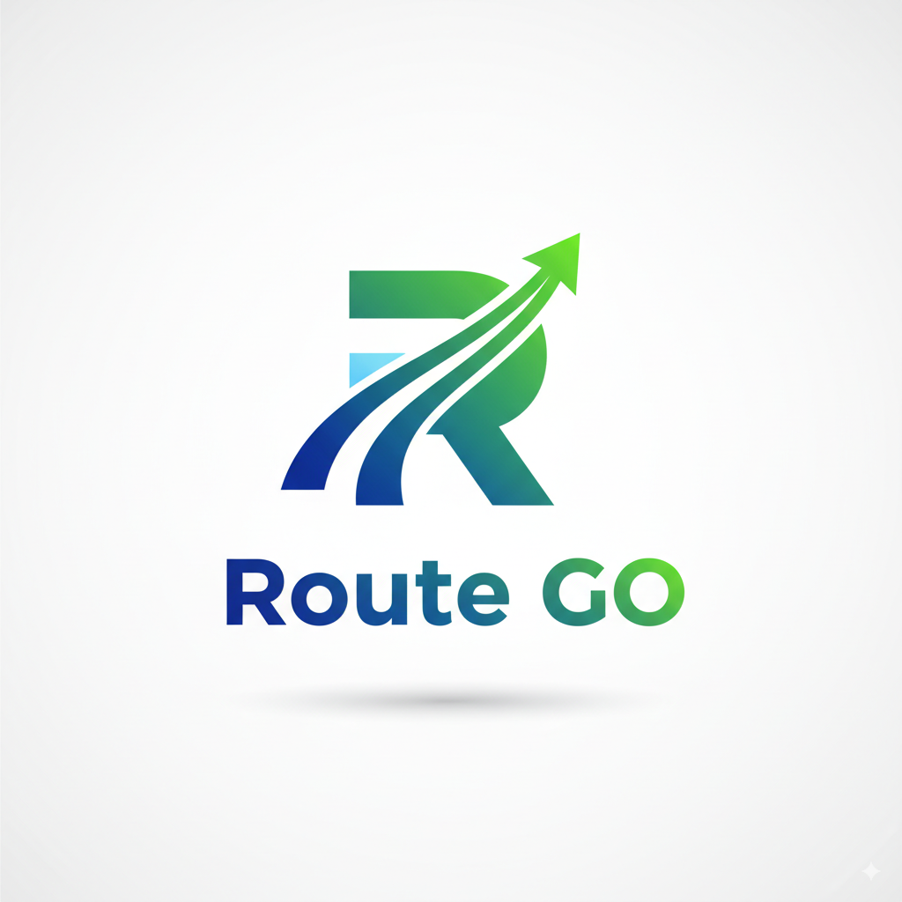

# Route GO - 営業向け訪問先管理アプリ

---

## 🎯 Route GO概要

### ターゲットユーザー
ルート営業担当

### 開発目的
顧客情報等を一元化することで、営業担当者の負担軽減を図る

### 主要機能
1. **情報の一元化**: 顧客、アポイントメント、対応記録
2. **営業サポート**: 顧客ソート機能によるアシスト
3. **データ活用**: 訪問履歴の蓄積による営業戦略の改善

---
## 🚀 機能詳細
### 1. 顧客管理機能
- 基本情報(名称、住所、連絡先、備考)

### 2. アポイントメント管理機能
- 訪問情報(日時、方法、メモ)

### 3. ルート機能
- 顧客間のルートと所要時間の表示

### 4. サポート機能
- 訪問先提案(距離、訪問日)

---

# 🖥️ 画面仕様

---

## 📊 導入効果
<!-- _backgroundColor: white -->
<!-- _backgroundImage: url('./public/images/導入効果.png') -->
<!-- _backgroundSize: 40% -->
<!-- _backgroundPosition: right bottom -->

#### 営業活動の改善
- **計画性向上**: スケジュール最適化
- **情報共有**: チームの情報共有促進(将来的に搭載)
- **顧客関係強化**: 訪問履歴の蓄積による関係性の可視化

---

## 💡 工夫点

### 1. トップページの情報集約
- **必要な情報を一画面に集約**
  - 今日の予定
  - 顧客情報
 
### 2. アクセス性の向上
- **重要機能へのアクセス最適化**
  - 頻繁に使用する機能を浅い階層に配置
  - ワンクリックでアポイントメント作成

---

## 🔜 追加機能（予定）

### 1. 共有機能
  - 引き継ぎ資料作成

### 2. ルート機能の強化
  - リアルタイム情報の反映(渋滞等)
  - 車以外でのルート検索

### 3. マネジメント機能追加
  - 管理職向けシステムの実装

---
